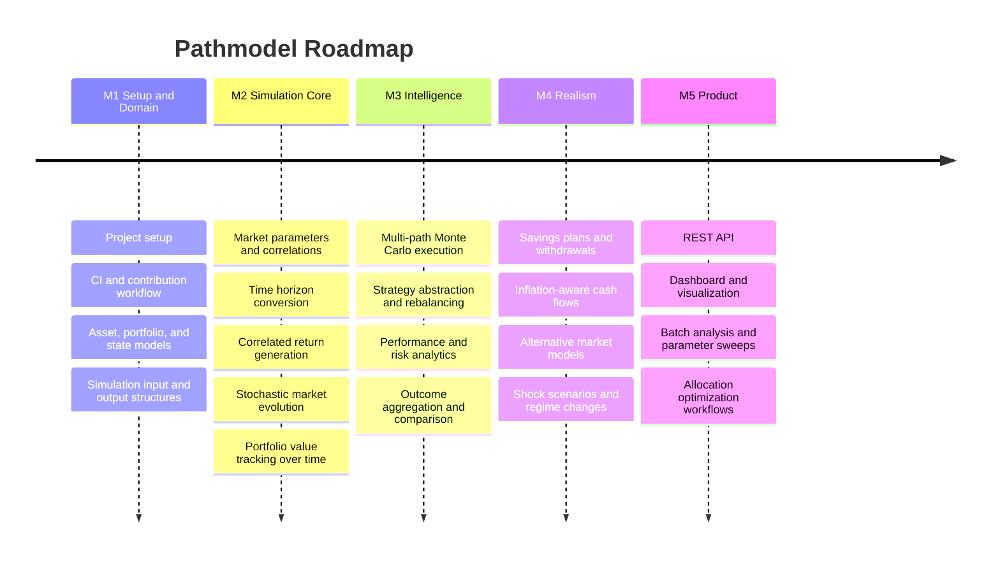

# Pathmodel

**Pathmodel** is a Monte Carlo simulation framework for financial markets and investment strategies.

It simulates correlated asset classes across many possible future paths to systematically analyze investment strategies
and portfolio development.

---

## Tech Stack

| Technology  | Version | Purpose                       |
|-------------|---------|-------------------------------|
| Java        | 25      | Programming language          |
| Spring Boot | 4.0.3   | Application framework         |
| Maven       | 3.9+    | Build tool (wrapper included) |
| JUnit 5     | -       | Testing framework             |
| Checkstyle  | -       | Code style enforcement        |

---

## Quick Start

### Prerequisites

- **JDK 25+** installed and on your `PATH`
- **Git** for version control

### Build & Run

```bash
cd PathmodelBackend

# Build (compile + test + package)
./mvnw clean install          # Linux / macOS
mvnw.cmd clean install        # Windows

# Run the application
./mvnw spring-boot:run
```

### Run Tests

```bash
./mvnw test
```

### Run Checkstyle

```bash
./mvnw checkstyle:check
```

> No Maven installation required - the project includes a Maven Wrapper (`mvnw` / `mvnw.cmd`).

---

## CI Pipeline

The project uses a CI pipeline to validate every push and pull request:

| Step       | Command                | Purpose                        |
|------------|------------------------|--------------------------------|
| Compile    | `mvn compile`          | Verify code compiles           |
| Test       | `mvn test`             | Run all unit tests             |
| Checkstyle | `mvn checkstyle:check` | Enforce coding conventions     |
| Package    | `mvn package`          | Build the application artifact |

You can replicate the full CI pipeline locally with:

```bash
cd PathmodelBackend
./mvnw clean verify
```

---

## Contributing

We welcome contributions. Please read the **[Contributing Guide](CONTRIBUTING.md)** for:

- Code style and conventions
- How to build and test
- Commit message format
- Branch workflow and PR process

---

## Roadmap

Development is organized into broader **milestones** with clear deliverables.

## Plan (Mermaid)



---

## Milestone 1 - Setup and Domain

**Goal:** Establish the project foundation and core financial domain model.

### Tasks

- Initialize the project with build tool and framework
- Define project structure and package layout
- Set up version control and repository
- Add documentation and contribution guidelines
- Configure CI pipeline
- Define asset types and classifications
- Model portfolios and positions
- Model market state and asset prices
- Define simulation input and output structures

### Deliverable

The project builds successfully and all core domain objects are in place.

---

## Milestone 2 - Market and Portfolio Simulation Core

**Goal:** Build the simulation core from market dynamics to portfolio evolution.

### Tasks

- Model expected returns and volatility
- Support conversion between time horizons (annual to daily)
- Model correlations between asset classes
- Generate correlated random numbers
- Implement required linear algebra operations
- Define a market simulation abstraction
- Implement a stochastic price model (e.g. Geometric Brownian Motion)
- Simulate price evolution over multiple time steps
- Generate initial market conditions
- Initialize a portfolio with capital and allocation
- Update portfolio value based on market movements
- Track simulation progress over time

### Deliverable

The market and portfolio can be simulated coherently over time.

---

## Milestone 3 - Monte Carlo, Strategies, and Analytics

**Goal:** Scale simulations, support strategy behavior, and evaluate outcomes.

### Tasks

- Run single and multiple simulation paths
- Parallelize path computation for performance
- Aggregate basic statistics across paths (mean, median, min/max)
- Define a strategy abstraction
- Implement common strategies (buy-and-hold, rebalancing, static allocation)
- Support portfolio reweighting and transaction modeling
- Compute performance metrics (return, volatility, Sharpe ratio)
- Compute risk metrics (max drawdown, worst case, Value at Risk)
- Evaluate simulation outcomes (success probability, distribution analysis)

### Deliverable

Strategies can be simulated at scale and evaluated with meaningful analytics.

---

## Milestone 4 - Realistic Scenarios and Advanced Market Models

**Goal:** Increase realism in both investor behavior and market behavior.

### Tasks

- Model periodic contributions with optional growth
- Model withdrawal strategies (fixed, percentage-based)
- Incorporate inflation adjustments
- Support alternative return models (historical bootstrapping, mean reversion)
- Simulate market shocks and crash scenarios
- Model market regime changes (bull / bear phases)

### Deliverable

Long-term wealth development can be simulated under more realistic assumptions.

---

## Milestone 5 - API and Frontend

**Goal:** Expose the simulation engine through stable product interfaces.

### Tasks

- Expose endpoints to start and retrieve simulations
- Define request and response data transfer objects
- Validate input and handle errors
- Build a dashboard to start simulations and display results
- Visualize portfolio paths and result distributions
- Choose and integrate a frontend framework and charting library
- Compare strategies across batch simulations
- Support parameter sweeps and sensitivity analysis
- Optimize asset allocation and approximate the efficient frontier

### Deliverable

Simulations can be run, analyzed, and visualized through user-facing interfaces.
