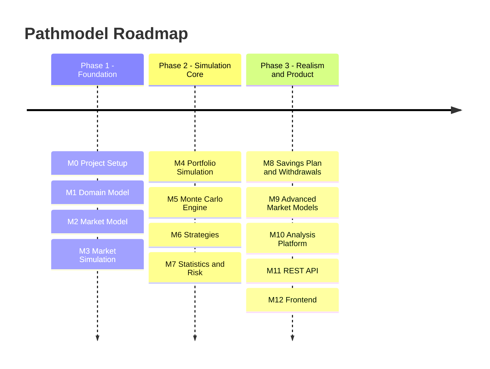

# Pathmodel

**Pathmodel** is a Monte Carlo simulation framework for financial markets and investment strategies.

It simulates correlated asset classes across many possible future paths to systematically analyze investment strategies
and portfolio development.

---

## Tech Stack

| Technology  | Version | Purpose                       |
|-------------|---------|-------------------------------|
| Java        | 17      | Programming language          |
| Spring Boot | 4.0.3   | Application framework         |
| Maven       | 3.9+    | Build tool (wrapper included) |
| JUnit 5     | —       | Testing framework             |
| Checkstyle  | —       | Code style enforcement        |

---

## Quick Start

### Prerequisites

- **JDK 17+** installed and on your `PATH`
- **Git** for version control

### Build & Run

```bash
cd PathmodelBackend

# Build (compile + test + package)
./mvnw clean install          # Linux / macOS
mvnw.cmd clean install        # Windows

# Run the application
./mvnw spring-boot:run
```

### Run Tests

```bash
./mvnw test
```

### Run Checkstyle

```bash
./mvnw checkstyle:check
```

> No Maven installation required — the project includes a Maven Wrapper (`mvnw` / `mvnw.cmd`).

---

## CI Pipeline

The project uses a CI pipeline to validate every push and pull request:

| Step       | Command                | Purpose                        |
|------------|------------------------|--------------------------------|
| Compile    | `mvn compile`          | Verify code compiles           |
| Test       | `mvn test`             | Run all unit tests             |
| Checkstyle | `mvn checkstyle:check` | Enforce coding conventions     |
| Package    | `mvn package`          | Build the application artifact |

You can replicate the full CI pipeline locally with:

```bash
cd PathmodelBackend
./mvnw clean verify
```

---

## Contributing

We welcome contributions! Please read the **[Contributing Guide](CONTRIBUTING.md)** for:

- Code style and conventions
- How to build and test
- Commit message format
- Branch workflow and PR process

---

## Roadmap

Development is organized into **milestones** with clear deliverables.

## Plan (Mermaid)



---

## Milestone 0 - Project Setup

**Goal:** Set up the basic project structure.

### Tasks

- Initialize the project with build tool and framework
- Define project structure and package layout
- Set up version control and repository
- Add documentation and contribution guidelines
- Configure CI pipeline

### Deliverable

The project starts successfully and can be built.

---

## Milestone 1 - Domain Model

**Goal:** Model the financial domain.

### Tasks

- Define asset types and classifications
- Model portfolios and positions
- Model market state and asset prices
- Define simulation input and output structures

### Deliverable

All core domain objects are in place.

---

## Milestone 2 - Market Model

**Goal:** Generate simulated asset movements.

### Tasks

- Model expected returns and volatility
- Support conversion between time horizons (annual ↔ daily)
- Model correlations between asset classes
- Generate correlated random numbers
- Implement required linear algebra operations

### Deliverable

Correlated daily returns can be generated.

---

## Milestone 3 - Market Simulation

**Goal:** Simulate the market over time.

### Tasks

- Define a market simulation abstraction
- Implement a stochastic price model (e.g. Geometric Brownian Motion)
- Simulate price evolution over multiple time steps
- Generate initial market conditions

### Deliverable

The market can be simulated over many days.

---

## Milestone 4 - Portfolio Simulation

**Goal:** Calculate portfolio development.

### Tasks

- Initialize a portfolio with capital and allocation
- Update portfolio value based on market movements
- Track simulation progress over time

### Deliverable

The portfolio follows market development.

---

## Milestone 5 - Monte Carlo Engine

**Goal:** Simulate many market paths.

### Tasks

- Run single and multiple simulation paths
- Parallelize path computation for performance
- Aggregate basic statistics across paths (mean, median, min/max)

### Deliverable

The Monte Carlo simulation works reliably.

---

## Milestone 6 - Strategies

**Goal:** Simulate different investment strategies.

### Tasks

- Define a strategy abstraction
- Implement common strategies (buy-and-hold, rebalancing, static allocation)
- Support portfolio reweighting and transaction modeling

### Deliverable

Strategies can be simulated and compared.

---

## Milestone 7 - Statistics and Risk

**Goal:** Calculate portfolio analytics.

### Tasks

- Compute performance metrics (return, volatility, Sharpe ratio)
- Compute risk metrics (max drawdown, worst case, Value at Risk)
- Evaluate simulation outcomes (success probability, distribution analysis)

### Deliverable

The simulation provides meaningful metrics.

---

## Milestone 8 - Savings Plan and Withdrawals

**Goal:** Simulate realistic life scenarios.

### Tasks

- Model periodic contributions with optional growth
- Model withdrawal strategies (fixed, percentage-based)
- Incorporate inflation adjustments

### Deliverable

Long-term wealth development can be simulated realistically.

---

## Milestone 9 - Advanced Market Models

**Goal:** Enable more realistic market simulation.

### Tasks

- Support alternative return models (historical bootstrapping, mean reversion)
- Simulate market shocks and crash scenarios
- Model market regime changes (bull / bear phases)

### Deliverable

Multiple market models can be used.

---

## Milestone 10 - Analysis Platform

**Goal:** Analyze strategies systematically.

### Tasks

- Compare strategies across batch simulations
- Support parameter sweeps and sensitivity analysis
- Optimize asset allocation and approximate the efficient frontier

### Deliverable

Strategies can be analyzed and optimized automatically.

---

## Milestone 11 - REST API

**Goal:** Run simulations externally.

### Tasks

- Expose endpoints to start and retrieve simulations
- Define request and response data transfer objects
- Validate input and handle errors

### Deliverable

Simulations can be controlled via the REST API.

---

## Milestone 12 - Frontend

**Goal:** Visualize simulation results.

### Tasks

- Build a dashboard to start simulations and display results
- Visualize portfolio paths and result distributions
- Choose and integrate a frontend framework and charting library

### Deliverable

Interactive analysis platform.
