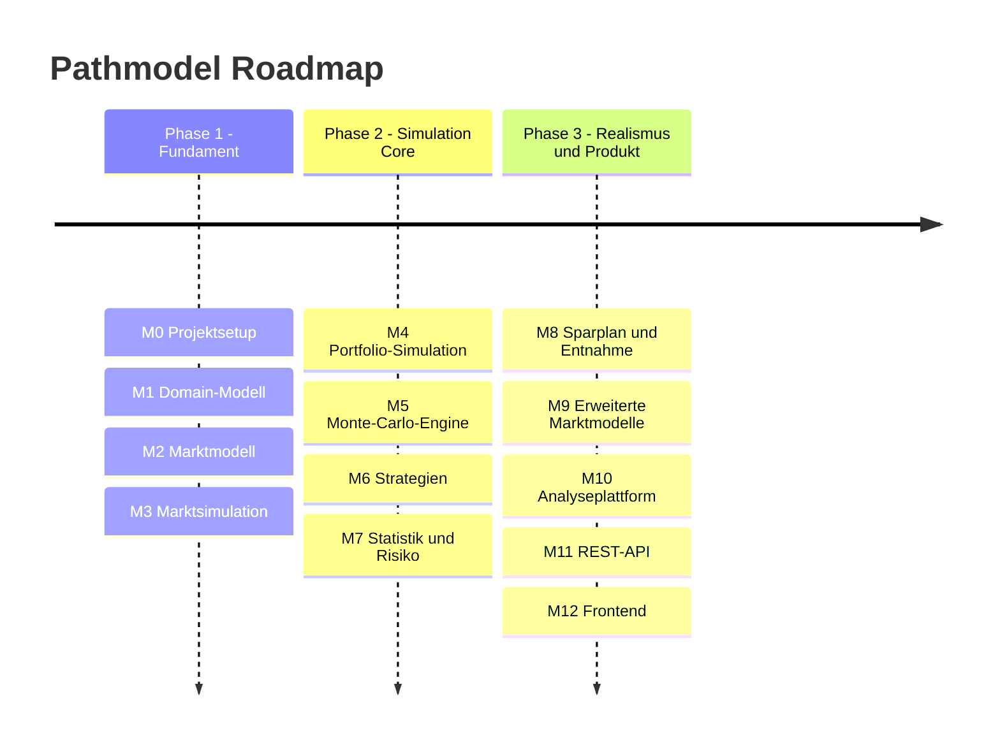

# Pathmodel

**Pathmodel** ist ein Monte-Carlo-Simulationsframework fuer Finanzmaerkte und Anlagestrategien.

Es simuliert korrelierte Assetklassen ueber viele moegliche Zukunftspfade, um Investmentstrategien und
Portfolioentwicklungen systematisch zu analysieren.

---

## Roadmap

Die Entwicklung erfolgt in **Milestones** mit klaren Deliverables.  
Die Struktur ist direkt fuer **GitHub-Milestones und Issues** nutzbar.

## Plan (Mermaid)

---

## Milestone 0 - Projektsetup

**Ziel:** Grundstruktur des Projekts aufsetzen.

### Tasks

- Spring-Boot-Projekt erstellen
- Maven-Struktur definieren
- Package-Struktur anlegen
- README erstellen
- GitHub-Repository einrichten
- CI-Pipeline (optional)

### Deliverable

Das Projekt startet erfolgreich und kann gebaut werden.

---

## Milestone 1 - Domain-Modell

**Ziel:** Finanzdomaene modellieren.

### Asset-Modell

- `Asset`-Interface erstellen
- `AssetClass`-Enum erstellen
- `BasicAsset`-Implementierung erstellen

### Portfolio

- `Position`-Modell erstellen
- `Portfolio`-Klasse erstellen
- `PortfolioValue`-Berechnung implementieren

### Market

- `MarketState`-Modell erstellen
- `AssetPrice`-Modell erstellen

### Simulation

- `SimulationRequest` erstellen
- `SimulationResult` erstellen
- `PathResult` erstellen

### Deliverable

Alle zentralen Domain-Objekte sind vorhanden.

---

## Milestone 2 - Marktmodell

**Ziel:** Simulierte Asset-Bewegungen erzeugen.

### Rendite-Modell

- `ExpectedReturn`-Modell erstellen
- `Volatility`-Modell erstellen
- Umrechnung von jaehrlichen zu taeglichen Renditen implementieren

### Korrelation

- `CorrelationMatrix`-Klasse erstellen
- Matrix-Validierung implementieren

### Zufallszahlen

- Gaussschen Zufallszahlengenerator implementieren
- Korrelierte Zufallszahlen erzeugen

### Mathematik

- Cholesky-Zerlegung implementieren
- Matrix-Multiplikation implementieren

### Deliverable

Korrelierte taegliche Renditen koennen erzeugt werden.

---

## Milestone 3 - Marktsimulation

**Ziel:** Markt ueber die Zeit simulieren.

### Tasks

- `MarketSimulator`-Interface erstellen
- `GeometricBrownianMotion` implementieren
- Asset-Preise aktualisieren
- Datum fortschreiben
- `InitialMarketState`-Generator erstellen

### Deliverable

Der Markt kann ueber viele Tage simuliert werden.

---

## Milestone 4 - Portfolio-Simulation

**Ziel:** Portfolioentwicklung berechnen.

### Portfolio-Initialisierung

- Initialkapital definieren
- Asset-Gewichtung festlegen

### Portfolio-Update

- `PortfolioValue`-Berechnung implementieren
- Asset-Preise anwenden

### SimulationContext

- `SimulationDay` modellieren
- `PathIndex` modellieren

### Deliverable

Das Portfolio folgt der Marktentwicklung.

---

## Milestone 5 - Monte-Carlo-Engine

**Ziel:** Viele Marktpfade simulieren.

### SimulationEngine

- `runSinglePath` implementieren
- `runMultiplePaths` implementieren

### Parallelisierung

- ThreadPool integrieren
- Parallel Streams evaluieren

### Statistik

- Mean berechnen
- Median berechnen
- Min/Max berechnen

### Deliverable

Die Monte-Carlo-Simulation funktioniert stabil.

---

## Milestone 6 - Strategien

**Ziel:** Verschiedene Investmentstrategien simulieren.

### Strategy-Interface

- `InvestmentStrategy`-Interface definieren

### Strategien implementieren

- `BuyAndHoldStrategy`
- `PeriodicRebalanceStrategy`
- `StaticAllocationStrategy`

### Rebalancing

- Portfolio-Reweighting implementieren
- Transaktionsmodell integrieren

### Deliverable

Strategien koennen simuliert und verglichen werden.

---

## Milestone 7 - Statistik und Risiko

**Ziel:** Portfolioanalysen berechnen.

### Performance-Kennzahlen

- Annual Return
- Volatility
- Sharpe Ratio

### Risiko-Kennzahlen

- Max Drawdown
- Worst Case
- Value at Risk

### Simulation-Auswertung

- Erfolgswahrscheinlichkeit berechnen
- Verteilungsanalyse durchfuehren

### Deliverable

Die Simulation liefert aussagekraeftige Kennzahlen.

---

## Milestone 8 - Sparplan und Entnahme

**Ziel:** Realistische Lebenssituationen simulieren.

### Savings

- Monthly Contribution modellieren
- Einkommenswachstumsmodell integrieren

### Withdrawals

- Fixed-Withdrawal-Modell integrieren
- Percentage-Withdrawal-Modell integrieren

### Inflation

- Inflationsmodell integrieren

### Deliverable

Langfristige Vermoegensentwicklung kann realistisch simuliert werden.

---

## Milestone 9 - Erweiterte Marktmodelle

**Ziel:** Realistischere Marktsimulation ermoeglichen.

### Alternative Modelle

- Historical Bootstrapping
- Mean-Reversion-Modell

### Crash-Simulation

- Market-Shock-Modell
- Jump-Diffusion-Modell

### Marktregime

- Bull Market
- Bear Market

### Deliverable

Mehrere Marktmodelle koennen verwendet werden.

---

## Milestone 10 - Analyseplattform

**Ziel:** Strategien systematisch analysieren.

### Batch-Simulation

- Strategy Comparison
- Parameter Sweep

### Optimierung

- Asset-Allocation-Search
- Efficient-Frontier-Simulation

### Deliverable

Strategien koennen automatisch analysiert und optimiert werden.

---

## Milestone 11 - REST-API

**Ziel:** Simulationen extern starten.

### Controller

- `SimulationController` implementieren

### Endpoints

- `POST /simulations`
- `GET /simulations/{id}`

### DTOs

- `SimulationRequestDTO`
- `SimulationResultDTO`

### Deliverable

Simulationen koennen ueber die REST-API gesteuert werden.

---

## Milestone 12 - Frontend

**Ziel:** Simulationsergebnisse visualisieren.

### Dashboard

- Simulation starten
- Ergebnisse anzeigen

### Charts

- Portfolio-Pfade
- Histogramme

### Technologien

- Angular oder React
- Chart.js

### Deliverable

Interaktive Analyseplattform.
