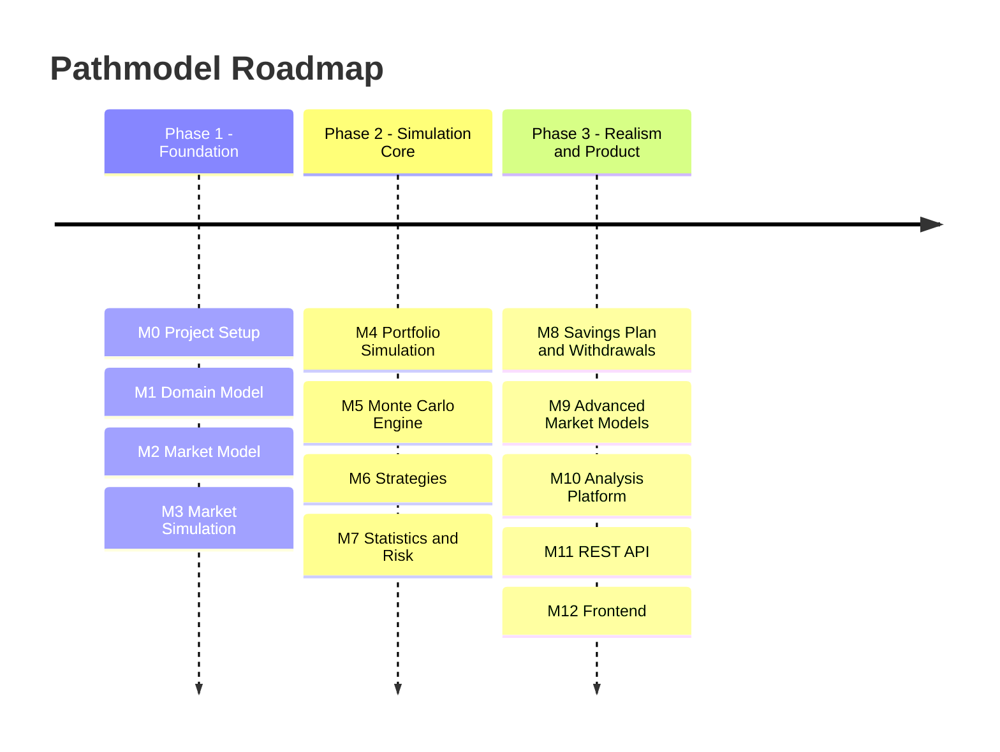

# Pathmodel

**Pathmodel** is a Monte Carlo simulation framework for financial markets and investment strategies.

It simulates correlated asset classes across many possible future paths to systematically analyze investment strategies
and portfolio development.

---

## Roadmap

Development is organized into **milestones** with clear deliverables.

## Plan (Mermaid)

---

## Milestone 0 - Project Setup

**Goal:** Set up the basic project structure.

### Tasks

- Create Spring Boot project
- Define Maven structure
- Create package structure
- Create README
- Set up GitHub repository
- CI pipeline (optional)

### Deliverable

The project starts successfully and can be built.

---

## Milestone 1 - Domain Model

**Goal:** Model the financial domain.

### Asset Model

- Create `Asset` interface
- Create `AssetClass` enum
- Create `BasicAsset` implementation

### Portfolio

- Create `Position` model
- Create `Portfolio` class
- Implement `PortfolioValue` calculation

### Market

- Create `MarketState` model
- Create `AssetPrice` model

### Simulation

- Create `SimulationRequest`
- Create `SimulationResult`
- Create `PathResult`

### Deliverable

All core domain objects are in place.

---

## Milestone 2 - Market Model

**Goal:** Generate simulated asset movements.

### Return Model

- Create `ExpectedReturn` model
- Create `Volatility` model
- Implement conversion from annual to daily returns

### Correlation

- Create `CorrelationMatrix` class
- Implement matrix validation

### Random Numbers

- Implement Gaussian random number generator
- Generate correlated random numbers

### Mathematics

- Implement Cholesky decomposition
- Implement matrix multiplication

### Deliverable

Correlated daily returns can be generated.

---

## Milestone 3 - Market Simulation

**Goal:** Simulate the market over time.

### Tasks

- Create `MarketSimulator` interface
- Implement `GeometricBrownianMotion`
- Update asset prices
- Advance date
- Create `InitialMarketState` generator

### Deliverable

The market can be simulated over many days.

---

## Milestone 4 - Portfolio Simulation

**Goal:** Calculate portfolio development.

### Portfolio Initialization

- Define initial capital
- Set asset allocation

### Portfolio Update

- Implement `PortfolioValue` calculation
- Apply asset prices

### SimulationContext

- Model `SimulationDay`
- Model `PathIndex`

### Deliverable

The portfolio follows market development.

---

## Milestone 5 - Monte Carlo Engine

**Goal:** Simulate many market paths.

### SimulationEngine

- Implement `runSinglePath`
- Implement `runMultiplePaths`

### Parallelization

- Integrate thread pool
- Evaluate parallel streams

### Statistics

- Calculate mean
- Calculate median
- Calculate min/max

### Deliverable

The Monte Carlo simulation works reliably.

---

## Milestone 6 - Strategies

**Goal:** Simulate different investment strategies.

### Strategy Interface

- Define `InvestmentStrategy` interface

### Implement Strategies

- `BuyAndHoldStrategy`
- `PeriodicRebalanceStrategy`
- `StaticAllocationStrategy`

### Rebalancing

- Implement portfolio reweighting
- Integrate transaction model

### Deliverable

Strategies can be simulated and compared.

---

## Milestone 7 - Statistics and Risk

**Goal:** Calculate portfolio analytics.

### Performance Metrics

- Annual Return
- Volatility
- Sharpe Ratio

### Risk Metrics

- Max Drawdown
- Worst Case
- Value at Risk

### Simulation Evaluation

- Calculate probability of success
- Perform distribution analysis

### Deliverable

The simulation provides meaningful metrics.

---

## Milestone 8 - Savings Plan and Withdrawals

**Goal:** Simulate realistic life scenarios.

### Savings

- Model monthly contributions
- Integrate income growth model

### Withdrawals

- Integrate fixed withdrawal model
- Integrate percentage withdrawal model

### Inflation

- Integrate inflation model

### Deliverable

Long-term wealth development can be simulated realistically.

---

## Milestone 9 - Advanced Market Models

**Goal:** Enable more realistic market simulation.

### Alternative Models

- Historical bootstrapping
- Mean reversion model

### Crash Simulation

- Market shock model
- Jump diffusion model

### Market Regimes

- Bull market
- Bear market

### Deliverable

Multiple market models can be used.

---

## Milestone 10 - Analysis Platform

**Goal:** Analyze strategies systematically.

### Batch Simulation

- Strategy comparison
- Parameter sweep

### Optimization

- Asset allocation search
- Efficient frontier simulation

### Deliverable

Strategies can be analyzed and optimized automatically.

---

## Milestone 11 - REST API

**Goal:** Run simulations externally.

### Controller

- Implement `SimulationController`

### Endpoints

- `POST /simulations`
- `GET /simulations/{id}`

### DTOs

- `SimulationRequestDTO`
- `SimulationResultDTO`

### Deliverable

Simulations can be controlled via the REST API.

---

## Milestone 12 - Frontend

**Goal:** Visualize simulation results.

### Dashboard

- Start simulation
- Display results

### Charts

- Portfolio paths
- Histograms

### Technologies

- Angular or React
- Chart.js

### Deliverable

Interactive analysis platform.
